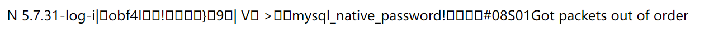
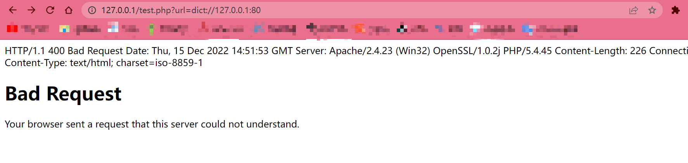
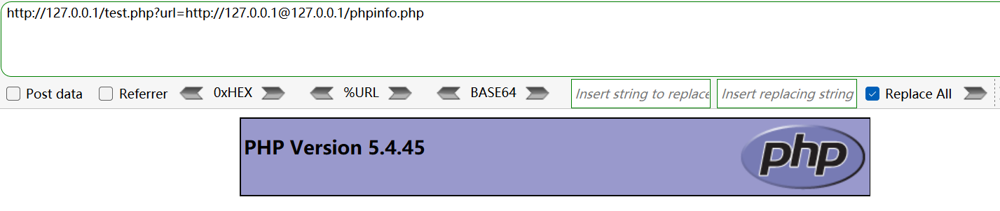

#### 【相关函数】

###### fsockopen()

打开 Internet 或 Unix 域套接字连接。

```php
fsockopen(hostname[, port, $errno, $errstr, timeout])
```

- hostname：主机名，如 www.w3schools.com 。
- port：端口，如果不想使用端口与主机通信，则省略或置 -1 。
- $errno、$errstr：连接错误时的错误信息，由 PHP 自动提供。
- timeout：指定连接超时的时间，单位秒。

###### curl_init()

```php
curl_init([url])
```

初始化一个新的会话，返回一个 cURL 句柄，供 curl_setopt()、curl_exec() 和 curl_close() 函数使用。

如果提供了参数 url ，CURLOPT_URL 将会被设置成这个值。你也可以使用curl_setopt() 函数手动设置 CURLOPT_URL 。

###### curl_exec()

```php
curl_exec($ch)
```

执行给定的 cURL 会话，函数将在初始化一个 cURL 会话并且全部的选项都被设置后被调用。成功时返回 TRUE， 失败时返回 FALSE。如果 CURLOPT_RETURNTRANSFER 选项被设置，函数执行成功时会返回执行的结果，失败时返回 FALSE 。

$ch：由 curl_init() 返回的 cURL 句柄。

以下代码传入 `?url=www.baidu.com` 将返回百度主页：

```php
<?php 
if (isset($_GET['url'])){
	$link = $_GET['url'];
	$curlobj = curl_init(); // 创建新的 cURL 资源
	curl_setopt($curlobj, CURLOPT_POST, 0);
	curl_setopt($curlobj,CURLOPT_URL,$link);
	curl_setopt($curlobj, CURLOPT_RETURNTRANSFER, 1); // 设置 URL 和相应的选项
	$result=curl_exec($curlobj); // 抓取 URL 并把它传递给浏览器
	curl_close($curlobj); // 关闭 cURL 资源，并且释放系统资源
	echo $result;
}
?>
```

#### 【SSRF的利用】

测试代码：

```php
<?php 
if (isset($_GET['url'])){
	$link = $_GET['url'];
	$curlobj = curl_init(); // 创建新的 cURL 资源
	curl_setopt($curlobj, CURLOPT_POST, 0);
	curl_setopt($curlobj,CURLOPT_URL,$link);
	curl_setopt($curlobj, CURLOPT_RETURNTRANSFER, 1); // 设置 URL 和相应的选项
	$result=curl_exec($curlobj); // 抓取 URL 并把它传递给浏览器
	curl_close($curlobj); // 关闭 cURL 资源，并且释放系统资源
	echo $result;
}
?>
```

###### 读取内网文件

&emsp;&emsp;使用 file:// 伪协议，传入如 `?url=file:///etc/passwd` 。

###### 探测内网存活主机

&emsp;&emsp;类似 XXE 中的相关内容，先读取目标主机的网络配置信息，如读取 /etc/hosts ，然后再进行网段爆破。

###### 扫描内网端口

&emsp;&emsp;dict 协议：在线网络字典协议，这个协议是用来架设一个字典服务的。用这个协议架设的服务可以用 telnet 来登陆，说明这个协议应该是基于 tcp 协议开发的。像 MySQL 的服务，因为也是基于 tcp 协议开发，所以用 dict 协议的方式打开也能强行读取一些 MySQL 服务的返回内容，如版本号：（传入`?url=dict://127.0.0.1:3306`）



&emsp;&emsp;查看内网主机上开放的端口及端口上运行的服务的版本信息等：

```
?url=dict://ip:6379 // redis
?url=dict://ip:80 // http
?url=dict://ip:22 // ssh
```

如果端口开放是有回显的，不开放则无回显：




#### 【绕过】

###### HTTP基本身份认证绕过

&emsp;&emsp;当限制请求的端口只能为 Web 端口，只允许访问 HTTP 和 HTTPS 的请求时。如限制访问的域名只能为 `http://www.xxx.com/` ，那么我们可以采用 HTTP 基本身份认证的方式绕过，即使用 @ ：`http://www.xxx.com@www.evil.com` 。


